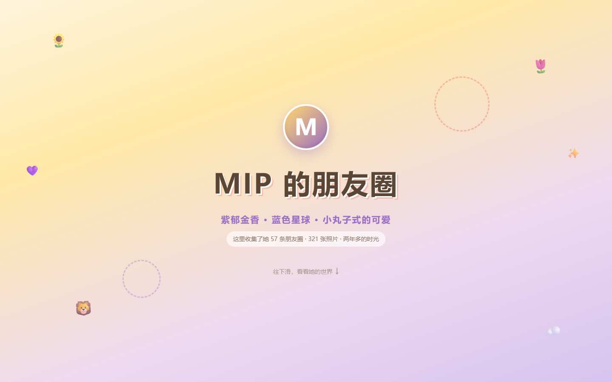

# 🎀 MIP Birthday Site

> 给最好的朋友的 20 岁生日礼物——小丸子风格朋友圈数字展览。

## 在线访问

**https://hua-haoyue.github.io/MIP-birthday-site/**

## 这是什么

把她半年可见 + 置顶的朋友圈做成一个沉浸式展览网站。从日常碎片到生日祝福，一页一页翻过去，就像翻开一本共同的回忆录。

## 设计

- **风格**：樱桃小丸子画风 × 她的朋友圈美学（紫色郁金香、蓝色 blue 风）
- **主色调**：奶油米白 + 淡紫 + 雾霾蓝
- **尾页**：翻到最后一页触发生日动画

## 交互

- 水彩光晕光标
- 滚动视差 + 卡片弹性入场
- 悬停 3D 倾斜、图片微放大
- 翻书式淡入淡出转场
- 轻柔背景音乐

## 技术

- 原生 HTML / CSS / JS
- 数据来源：[wxMoments](https://github.com/claudemt/wxMoments)
- 部署：GitHub Pages

## 寄语

> 二十岁啦，愿你继续做那个会对生活说出「好幸福啊」的女孩。
>
> Best Friend Forever — HHY · 2026.10.06
